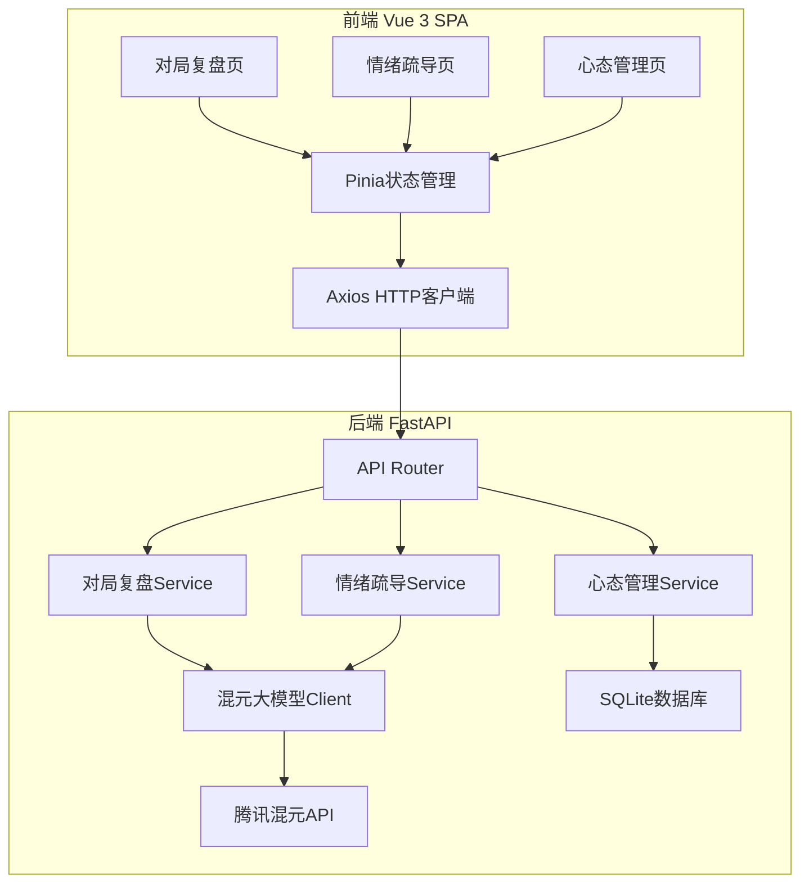

## 产品概述

"战术视界"是一款面向大众电竞玩家的对局复盘与心态指导智能体，以王者荣耀李白IP风格为交互载体，提供"技术复盘+情感疏导"双核心服务。项目为全新创建，工作区当前为空。

## 核心功能（MVP）

- **多模态对局复盘解析**: 玩家提交对局数据（文本描述/截图/数据JSON），系统通过混元大模型分析操作失误、决策漏洞，以通俗易懂的李白风格语言输出复盘报告
- **王者荣耀IP式情绪疏导**: 以李白潇洒侠客角色口吻进行共情式安抚，识别玩家沮丧/烦躁/绝望等负面情绪，给予励志鼓励与正向引导
- **个性化战术优化指导**: 基于玩家游戏习惯、常用英雄、历史失误记录，生成专属上分战术建议与操作改进方案
- **全程心态管理**: 赛前心态预热、赛后情绪感知与前置疏导、电竞心态养成笔记（记录心态变化轨迹）

## 使用场景

单排失利后复盘疏导、连跪崩盘心态安抚、新手进阶学习、赛前心态预热、逆风局心态支撑

## 技术要求

- 前端: Vue 3 + Vite + Element Plus + Pinia
- 后端: Python FastAPI + asyncio
- AI: 腾讯混元大模型API直接对接（tencentcloud-sdk-python-hunyuan）
- IP风格: 王者荣耀李白潇洒侠客风格
- 数据持久化: SQLite（轻量级，适合MVP演示）

## 技术栈选择

- **前端**: Vue 3 (Composition API + `<script setup>`) + Vite + TypeScript + Element Plus + Pinia + Tailwind CSS
- **后端**: Python 3.10+ + FastAPI + Uvicorn + SQLAlchemy + SQLite
- **AI集成**: tencentcloud-sdk-python-hunyuan SDK（调用腾讯混元大模型ChatCompletions接口）
- **数据存储**: SQLite + SQLAlchemy ORM
- **异步通信**: 后端SSE（Server-Sent Events）实现AI回复流式输出
- **API规范**: RESTful + OpenAPI文档

## 实现方案

### 系统架构

采用前后端分离架构，前端Vue 3 SPA通过REST API与FastAPI后端通信，后端调用腾讯混元大模型API完成AI推理。



### 核心模块设计

**1. AI交互层（hunyuan_client.py）**

- 封装`tencentcloud.hunyuan.v20230901` SDK调用
- 支持流式/非流式ChatCompletions接口
- 内置三套标准化Prompt模板（复盘/疏导/战术），均注入李白角色设定
- 情绪识别通过Prompt工程实现（让模型先判定情绪类别再生成疏导内容）
- 错误重试与超时处理

**2. 业务服务层**

- `review_service.py`: 对局数据解析 + AI复盘调用 + 报告结构化
- `emotion_service.py`: 情绪感知 + 分级疏导策略（轻度/中度/重度负面情绪）
- `tactics_service.py`: 玩家画像构建 + 个性化战术生成
- `mindset_service.py`: 心态记录CRUD + 成长轨迹分析 + 赛前预热内容生成

**3. 前端页面**

- 对局复盘页: 对局数据输入表单 + AI流式复盘报告展示 + 历史记录
- 情绪疏导页: 聊天式对话界面 + 情绪状态指示器 + 快捷场景选择
- 心态管理页: 心态日历/趋势图 + 养成笔记 + 赛前预热卡片
- 通用: 侧边栏导航 + 李白IP角色头像/问候语 + 响应式布局

### 数据流

1. 用户输入对局描述/选择场景 -> 前端Pinia管理状态 -> POST到FastAPI
2. FastAPI Service组装Prompt（李白角色设定+用户数据+场景模板）-> 调用混元API
3. 混元API返回AI生成内容（流式SSE）-> 前端逐步渲染
4. 心态相关数据同步写入SQLite持久化

### 性能与可靠性

- 混元API调用设置30秒超时，3次重试（指数退避）
- SSE流式输出降低用户等待感知
- SQLite适合单机MVP演示，后续可迁移至MySQL
- 前端请求防抖+Loading状态管理

## 目录结构

```
c:/Users/zhangfuhua/CodeBuddy/20260330154354/
├── frontend/                          # Vue 3 前端项目
│   ├── index.html                     # 入口HTML
│   ├── vite.config.ts                 # Vite配置（含API代理）
│   ├── tsconfig.json                  # TypeScript配置
│   ├── tailwind.config.js             # Tailwind CSS配置
│   ├── package.json                   # 依赖声明
│   ├── src/
│   │   ├── App.vue                    # [NEW] 根组件，路由出口+全局布局
│   │   ├── main.ts                    # [NEW] 应用入口，挂载Vue/Router/Pinia
│   │   ├── router/
│   │   │   └── index.ts               # [NEW] Vue Router路由配置（3个主页面）
│   │   ├── stores/
│   │   │   ├── chat.ts                # [NEW] 对话状态管理（消息列表/流式追加/清空）
│   │   │   └── mindset.ts             # [NEW] 心态记录状态管理（CRUD/趋势数据）
│   │   ├── api/
│   │   │   ├── request.ts             # [NEW] Axios实例配置（ baseURL/拦截器/SSE封装）
│   │   │   ├── review.ts              # [NEW] 对局复盘API（提交数据/获取历史）
│   │   │   ├── emotion.ts             # [NEW] 情绪疏导API（发送消息/SSE流式接收）
│   │   │   └── mindset.ts             # [NEW] 心态管理API（记录/查询/预热）
│   │   ├── components/
│   │   │   ├── AppLayout.vue          # [NEW] 整体布局（侧边栏导航+内容区）
│   │   │   ├── Sidebar.vue            # [NEW] 侧边栏（导航菜单+李白角色展示）
│   │   │   ├── ChatBubble.vue         # [NEW] 聊天气泡组件（区分用户/AI消息）
│   │   │   ├── ChatInput.vue          # [NEW] 聊天输入框（支持发送/快捷场景）
│   │   │   ├── EmotionIndicator.vue   # [NEW] 情绪状态指示器（可视化当前情绪）
│   │   │   ├── ReviewForm.vue         # [NEW] 对局数据输入表单
│   │   │   ├── ReviewReport.vue       # [NEW] 复盘报告展示组件（Markdown渲染）
│   │   │   ├── MindsetCalendar.vue    # [NEW] 心态日历组件（每日情绪记录）
│   │   │   └── MarkdownRenderer.vue   # [NEW] Markdown内容渲染组件
│   │   ├── views/
│   │   │   ├── ReviewView.vue         # [NEW] 对局复盘页面（表单+报告+历史）
│   │   │   ├── EmotionView.vue        # [NEW] 情绪疏导页面（聊天式对话）
│   │   │   └── MindsetView.vue        # [NEW] 心态管理页面（日历/笔记/预热）
│   │   ├── styles/
│   │   │   └── global.css             # [NEW] 全局样式（Tailwind指令+自定义CSS变量）
│   │   ├── types/
│   │   │   └── index.ts               # [NEW] TypeScript类型定义（消息/复盘/心态）
│   │   └── utils/
│   │       └── sse.ts                 # [NEW] SSE流式响应处理工具
│   └── public/
│       └── favicon.ico                # 网站图标
│
├── backend/                           # FastAPI 后端项目
│   ├── requirements.txt               # Python依赖（fastapi/uvicorn/sqlalchemy/tencentcloud-sdk-python-hunyuan等）
│   ├── run.py                         # [NEW] 应用启动入口（uvicorn启动）
│   ├── app/
│   │   ├── __init__.py
│   │   ├── config.py                  # [NEW] 配置管理（环境变量/腾讯云密钥/数据库路径）
│   │   ├── database.py                # [NEW] SQLAlchemy引擎与会话配置
│   │   ├── models.py                  # [NEW] 数据模型（MindsetRecord/ReviewHistory/PlayerProfile）
│   │   ├── schemas.py                 # [NEW] Pydantic请求/响应模型
│   │   ├── main.py                    # [NEW] FastAPI应用创建+路由注册+CORS配置
│   │   ├── routers/
│   │   │   ├── __init__.py
│   │   │   ├── review.py              # [NEW] 对局复盘路由（POST提交/GET历史）
│   │   │   ├── emotion.py             # [NEW] 情绪疏导路由（POST消息/SSE流式响应）
│   │   │   └── mindset.py             # [NEW] 心态管理路由（CRUD/查询/预热）
│   │   ├── services/
│   │   │   ├── __init__.py
│   │   │   ├── hunyuan_client.py      # [NEW] 混元大模型SDK封装（ChatCompletions/流式/重试）
│   │   │   ├── prompt_templates.py    # [NEW] Prompt模板管理（李白角色设定/复盘/疏导/战术）
│   │   │   ├── review_service.py      # [NEW] 复盘业务逻辑（数据解析+AI调用+报告生成）
│   │   │   ├── emotion_service.py     # [NEW] 情绪疏导业务逻辑（情绪识别+分级疏导）
│   │   │   ├── tactics_service.py     # [NEW] 战术优化业务逻辑（玩家画像+个性化建议）
│   │   │   └── mindset_service.py     # [NEW] 心态管理业务逻辑（记录/趋势/预热）
│   │   └── utils/
│   │       ├── __init__.py
│   │       └── helpers.py             # [NEW] 工具函数（时间处理/数据格式化）
│   └── .env.example                   # [NEW] 环境变量模板（TENCENT_SECRET_ID/KEY等）
│
└── README.md                          # [NEW] 项目说明文档
```

## 实现注意事项

- **腾讯云API鉴权**: 使用tencentcloud-sdk-python-hunyuan SDK，需配置SecretId/SecretKey环境变量，通过`.env`文件管理，切勿硬编码
- **Prompt工程**: 三套Prompt模板均需注入李白角色system message，角色设定包含性格特质（潇洒侠客）、语气风格（诗意热血）、经典台词引用等
- **SSE流式输出**: 后端通过`StreamingResponse` + `text/event-stream`实现，前端使用EventSource或fetch+ReadableStream接收
- **CORS配置**: FastAPI需配置允许前端dev server跨域访问
- **错误处理**: AI API调用失败时提供友好降级提示，避免前端崩溃

## 设计风格

采用"王者荣耀-水墨国风"设计风格，以游戏内李白角色的视觉特质为核心设计语言，打造沉浸式电竞AI助手体验。整体色调深邃沉稳，以墨蓝/暗金为主色，辅以水墨渐变纹理，营造东方武侠氛围。页面布局采用左侧固定导航栏+右侧主内容区的经典管理后台结构，导航栏融入李白角色剪影与游戏元素。

## 页面规划

### 页面1: 对局复盘页 (ReviewView)

- **顶部标题区**: 页面标题"对局复盘" + 李白角色问候语
- **数据输入区**: 左右分栏布局；左侧为对局数据输入表单（游戏选择、对局结果、KDA数据、对局描述文本域、截图上传）；右侧为快捷模板按钮（"刚才一把排位输了""连跪三把心态崩了"等预设场景）
- **复盘报告区**: AI生成的复盘报告展示，支持Markdown渲染，带有"正在分析中..."打字机效果加载动画
- **历史记录区**: 下方折叠面板，展示历史复盘记录列表，支持点击查看详情

### 页面2: 情绪疏导页 (EmotionView)

- **情绪状态条**: 顶部横向情绪指示器，可视化当前情绪状态（从"热血沸腾"到"心态崩盘"渐变色条）
- **对话区域**: 占据页面主要区域，聊天式对话界面；AI消息带有李白角色头像和"青莲剑仙"标识；用户消息右对齐；支持Markdown渲染
- **输入区域**: 底部固定输入栏，包含文本输入框、发送按钮、快捷场景按钮（"输了心情不好""队友太坑了""逆风局怎么翻盘"）
- **打字效果**: AI回复采用逐字流式显示，模拟实时对话

### 页面3: 心态管理页 (MindsetView)

- **心态日历区**: 左侧日历组件，每日格子上用颜色标记情绪状态（绿色好/黄色一般/红色差），点击日期查看详情
- **赛前预热卡片**: 右上方卡片，包含今日励志语录（李白风格）、赛前心态提醒、一键生成预热鼓励
- **心态趋势图**: 右下方折线图，展示近7/30天情绪趋势变化
- **养成笔记区**: 下方时间线列表，记录每次心态疏导后的感悟与成长

## 通用组件设计

- **侧边栏导航**: 深色背景+水墨纹理，顶部放置李白角色圆形头像，三个导航项配有国风图标
- **聊天气泡**: AI消息使用左侧深色气泡+角色头像，用户消息使用右侧金色气泡，均带微妙阴影
- **情绪指示器**: 渐变色条动画，配合文字标签，实时反映情绪状态变化

## Agent Extensions

- **code-explorer**
- 用途: 在后端开发过程中，用于搜索和验证腾讯云Python SDK的API调用模式、确认项目文件结构一致性
- 预期结果: 确保混元大模型SDK调用代码符合官方规范，项目文件结构完整无遗漏